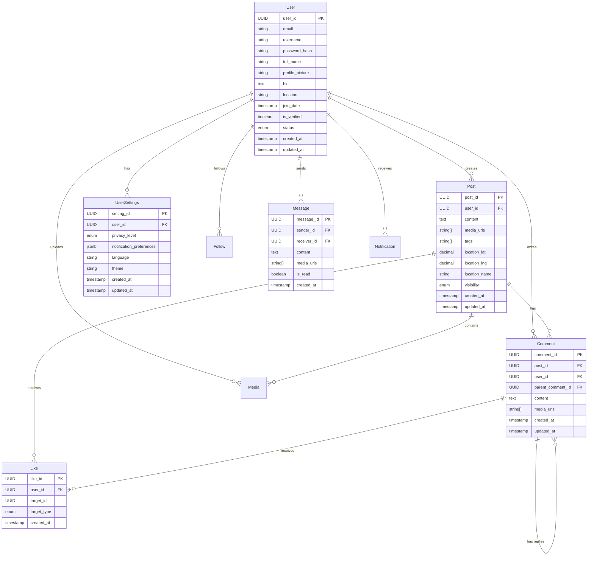
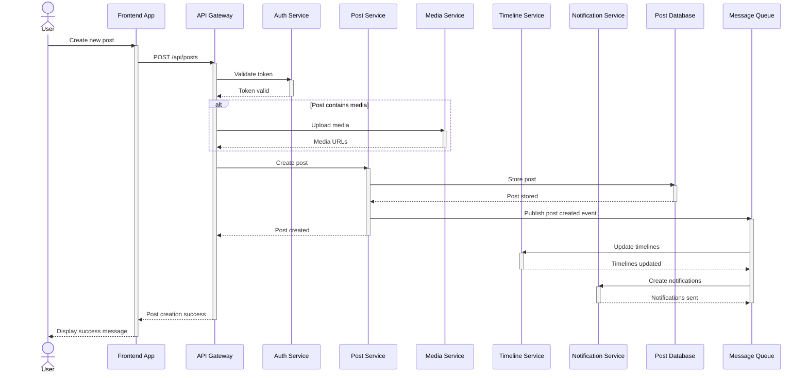
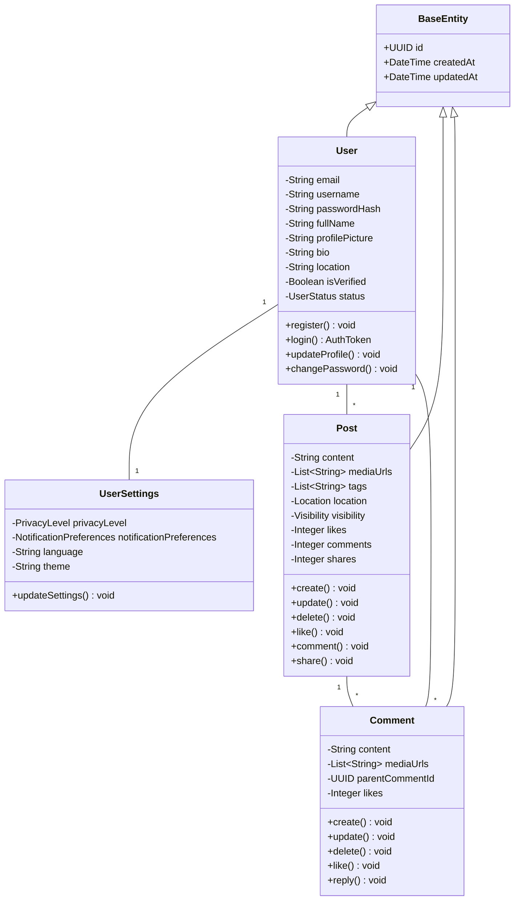

[[Social Media Project - Example - Requirement]]

### ER Diagram

```mermaid
erDiagram
    User ||--o{ Post : "creates"
    User ||--o{ Comment : "writes"
    User ||--o{ UserSettings : "has"
    User ||--o{ Follow : "follows"
    User ||--o{ Message : "sends"
    User ||--o{ Notification : "receives"
    User ||--o{ Media : "uploads"
    Post ||--o{ Comment : "has"
    Post ||--o{ Like : "receives"
    Post ||--o{ Media : "contains"
    Comment ||--o{ Like : "receives"
    Comment ||--o{ Comment : "has replies"

    User {
        UUID user_id PK
        string email
        string username
        string password_hash
        string full_name
        string profile_picture
        text bio
        string location
        timestamp join_date
        boolean is_verified
        enum status
        timestamp created_at
        timestamp updated_at
    }

    UserSettings {
        UUID setting_id PK
        UUID user_id FK
        enum privacy_level
        jsonb notification_preferences
        string language
        string theme
        timestamp created_at
        timestamp updated_at
    }

    Post {
        UUID post_id PK
        UUID user_id FK
        text content
        string[] media_urls
        string[] tags
        decimal location_lat
        decimal location_lng
        string location_name
        enum visibility
        timestamp created_at
        timestamp updated_at
    }

    Comment {
        UUID comment_id PK
        UUID post_id FK
        UUID user_id FK
        UUID parent_comment_id FK
        text content
        string[] media_urls
        timestamp created_at
        timestamp updated_at
    }

    Like {
        UUID like_id PK
        UUID user_id FK
        UUID target_id
        enum target_type
        timestamp created_at
    }

    Message {
        UUID message_id PK
        UUID sender_id FK
        UUID receiver_id FK
        text content
        string[] media_urls
        boolean is_read
        timestamp created_at
    }
```

### Use Case Diagram

```mermaid
graph TD
    %% Actors
    User(("User"))
    Guest(("Guest"))
    Admin(("Admin"))
    System(("System"))

    %% Authentication Package
    subgraph Authentication
        UC1[Register]
        UC2[Login]
        UC3[Reset Password]
        UC4[Manage OAuth]
    end

    %% Profile Management Package
    subgraph Profile_Management
        UC5[Edit Profile]
        UC6[Change Settings]
        UC7[Manage Privacy]
        UC8[View Profile]
    end

    %% Content Management Package
    subgraph Content_Management
        UC9[Create Post]
        UC10[Edit Post]
        UC11[Delete Post]
        UC12[Upload Media]
        UC13[Comment]
        UC14[Like/React]
        UC15[Share Post]
    end

    %% Relationships
    Guest --> UC1
    Guest --> UC2
    Guest --> UC8
    
    User --> UC3
    User --> UC4
    User --> UC5
    User --> UC6
    User --> UC7
    User --> UC9
    User --> UC10
    User --> UC11
    User --> UC12
    User --> UC13
    User --> UC14
    User --> UC15

    Admin --> UC16[Moderate Content]
    Admin --> UC17[Manage Users]
    Admin --> UC18[View Analytics]

    System --> UC19[Send Notifications]
```

### Sequence Diagram

```mermaid
sequenceDiagram
    actor User
    participant FE as Frontend App
    participant AG as API Gateway
    participant AS as Auth Service
    participant PS as Post Service
    participant MS as Media Service
    participant TS as Timeline Service
    participant NS as Notification Service
    participant PDB as Post Database
    participant MQ as Message Queue

    User->>FE: Create new post
    activate FE
    FE->>AG: POST /api/posts
    activate AG
    
    AG->>AS: Validate token
    activate AS
    AS-->>AG: Token valid
    deactivate AS

    alt Post contains media
        AG->>MS: Upload media
        activate MS
        MS-->>AG: Media URLs
        deactivate MS
    end

    AG->>PS: Create post
    activate PS
    PS->>PDB: Store post
    activate PDB
    PDB-->>PS: Post stored
    deactivate PDB

    PS->>MQ: Publish post created event
    activate MQ

    PS-->>AG: Post created
    deactivate PS

    MQ->>TS: Update timelines
    activate TS
    TS-->>MQ: Timelines updated
    deactivate TS

    MQ->>NS: Create notifications
    activate NS
    NS-->>MQ: Notifications sent
    deactivate NS

    deactivate MQ

    AG-->>FE: Post creation success
    deactivate AG

    FE-->>User: Display success message
    deactivate FE
```

### Class Diagram

```mermaid
classDiagram
    class BaseEntity {
        +UUID id
        +DateTime createdAt
        +DateTime updatedAt
    }

    class User {
        -String email
        -String username
        -String passwordHash
        -String fullName
        -String profilePicture
        -String bio
        -String location
        -Boolean isVerified
        -UserStatus status
        +register() void
        +login() AuthToken
        +updateProfile() void
        +changePassword() void
    }

    class UserSettings {
        -PrivacyLevel privacyLevel
        -NotificationPreferences notificationPreferences
        -String language
        -String theme
        +updateSettings() void
    }

    class Post {
        -String content
        -List~String~ mediaUrls
        -List~String~ tags
        -Location location
        -Visibility visibility
        -Integer likes
        -Integer comments
        -Integer shares
        +create() void
        +update() void
        +delete() void
        +like() void
        +comment() void
        +share() void
    }

    class Comment {
        -String content
        -List~String~ mediaUrls
        -UUID parentCommentId
        -Integer likes
        +create() void
        +update() void
        +delete() void
        +like() void
        +reply() void
    }

    BaseEntity <|-- User
    BaseEntity <|-- Post
    BaseEntity <|-- Comment
    User "1" -- "1" UserSettings
    User "1" -- "*" Post
    User "1" -- "*" Comment
    Post "1" -- "*" Comment
```

